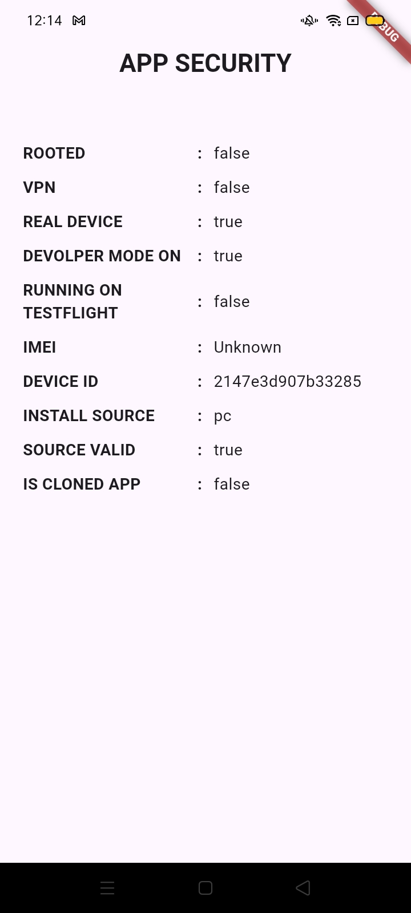

# 🔒 App Security SDK for Flutter

[](https://pub.dev/packages/app_security)
[](https://pub.dev/packages/app_security)
[](https://pub.dev/packages/app_security)

App Security SDK is a Flutter plugin that helps you secure your application by detecting unsafe environments like rooted/jailbroken devices, cloned apps, piracy, debugging, and more. It also validates the app’s integrity, detects VPN usage, and ensures the app is installed from trusted sources.

## 📷 Screenshots



## ✨ Features

- ✅ Root/Jailbreak Detection
    Detect if the device is rooted (Android) or jailbroken (iOS).

- ✅ VPN Detection
    Identify active VPN connections for network safety.

- ✅ Real Device Check
    Ensure the app runs on a real device and not on an emulator/simulator.

- ✅ Developer Mode & Debugging Check
    Detect whether the device is in developer mode or being debugged.

- ✅ Piracy Detection
    Validate app integrity and detect pirate apps using Kevlar.

- ✅ Install Source Verification
    Ensure the app was installed from trusted sources like Play Store, App Store, or TestFlight.

- ✅ Clone Detection
    Detect cloned or dual apps using sandbox validation.

- ✅ Device Identifier Access
    Fetch Device ID (Android ID) and Identifier for Vendor (iOS).

## 📦 Installation
Add the package to your `pubspec.yaml`:

```yaml
dependencies:
  app_security: ^latest_version
```

```sh
dependencies:
  flutter pub get
```


## 🚀 Usage
Import the package:
```dart
import 'package:app_security/app_security.dart';
```

### ✅ Root/Jailbreak Detection
```dart
bool isRooted = await AppSecurityApi().isUseJailBrokenOrRoot();
```

### 🔒 Check VPN Usage
```dart
bool vpnActive = await AppSecurityApi().isDeviceUseVPN();
```

### 🛡️ Validate App Environment
```dart
List<String>? issues = await AppSecurityApi().isSafeEnvironment();
print(issues); // e.g., ["JAILBREAK", "VPN_ACTIVE"]
```

### 📲 Get Device ID
```dart
String? deviceId = await AppSecurityApi().getDeviceId();
```

### 🛠 Check Install Source
```dart
String? source = await AppSecurityApi().installSource();
print(source); // e.g., "playstore", "appstore", "testflight"
```

### 🔍 Detect Cloned App
```dart
bool isCloned = await AppSecurityApi().isClonedApp();
```

## 🛡 Supported Platforms
- ✅ Android: Uses Kevlar for root and piracy detection.
- ✅ iOS: Implements native checks for jailbreak, VPN, and integrity.


## 🛠️ Customization
    - Configure allowed installers: Play Store, App Store, TestFlight.
    - Extend detection for enterprise distribution or sideloaded apps.

## 📄 License
This project is licensed under the MIT License. See the [LICENSE](https://github.com/deepak07082/app_security/blob/main/LICENSE) file for details.

## 💬 Contributing
Feel free to submit issues or pull requests. Contributions are welcome!

## 🌐 Author
Made with ❤️ by Deepak.